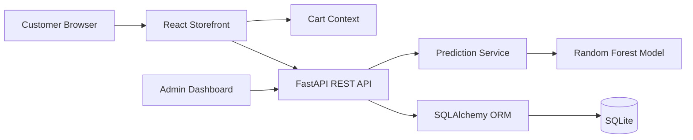

# 🛒 Cart Rescue AI

> AI-powered ecommerce platform for predicting cart abandonment and recommending targeted recovery actions.

## 📋 Table of Contents

- [Project Overview](#-project-overview)
- [Features](#-features)
- [Technologies Used](#-technologies-used)
- [System Architecture](#-system-architecture)
- [Folder Structure](#-folder-structure)
- [Installation Steps](#-installation-steps)
- [API Endpoints](#-api-endpoints)
- [Database Design](#-database-design)
- [Machine Learning Workflow](#-machine-learning-workflow)
- [Screenshots](#-screenshots)
- [Future Scope](#-future-scope)
- [Team Members](#-team-members)

## 🔎 Project Overview

Cart Rescue AI combines a customer-facing shopping experience with a machine-learning analytics platform. It captures shopping-session signals automatically, predicts abandonment probability, classifies risk, and recommends timely recovery actions.

The platform includes a responsive storefront, product details, cart and checkout flows, prediction history, and an admin analytics dashboard. Customers never need to manually enter analytics fields such as device, session duration, cart value, or traffic source.

## ✨ Features

### Customer experience

- Responsive dark ecommerce storefront
- Hero banner and featured products
- Product search and category filtering
- Product ratings, reviews, discounts, and stock indicators
- Product detail pages with image gallery and specifications
- Add to cart, remove item, and quantity controls
- Local cart persistence with `localStorage`
- Checkout with automatically collected session analytics

### AI and analytics

- Scikit-Learn Random Forest abandonment model
- Probability scores generated with `predict_proba()`
- HIGH, MEDIUM, and LOW risk classification
- AI insight explanations and recovery recommendations
- Prediction history with pagination
- Admin metrics for predictions, risk levels, average score, and revenue
- Chart.js risk, trend, and revenue visualizations
- Automatic model training when the saved artifact is unavailable

## 🧰 Technologies Used

| Layer            | Technologies                                         |
| ---------------- | ---------------------------------------------------- |
| Frontend         | React 18, Vite, React Router, Tailwind CSS, Axios    |
| Visualization    | Chart.js                                             |
| Backend          | Python 3.12, FastAPI, Uvicorn, Pydantic              |
| Persistence      | SQLite, SQLAlchemy ORM                               |
| Machine learning | Scikit-Learn, Pandas, RandomForestClassifier, Joblib |

## 🏗️ System Architecture



### Request flow

1. The customer browses products and adds items to the cart.
2. The frontend calculates session duration, item count, cart value, device, and referrer.
3. Checkout sends the session payload to FastAPI.
4. The model returns an abandonment probability.
5. The backend stores the session and prediction in SQLite.
6. The dashboard retrieves prediction history and renders analytics.

## 📁 Folder Structure

```text
CartRescueAI/
├── backend/
│   └── app/
│       ├── crud.py
│       ├── database.py
│       ├── main.py
│       ├── models.py
│       ├── schemas.py
│       ├── routers/
│       │   ├── prediction.py
│       │   └── shopping.py
│       └── services/
│           ├── ml_model.py
│           └── cart_rescue_model.joblib
├── frontend/
│   └── src/
│       ├── App.jsx
│       ├── components/
│       ├── context/
│       ├── data/
│       └── pages/
├── requirements.txt
└── README.md
```

## 🚀 Installation Steps

### Prerequisites

- Python 3.12+
- Node.js 18+
- npm

### 1. Clone and enter the project

```bash
git clone <repository-url>
cd CartRescueAI
```

### 2. Create a Python environment

Windows PowerShell:

```powershell
python -m venv .venv
.\.venv\Scripts\Activate.ps1
```

macOS/Linux:

```bash
python3 -m venv .venv
source .venv/bin/activate
```

### 3. Install backend dependencies

```bash
pip install -r requirements.txt
```

### 4. Install frontend dependencies

```bash
cd frontend
npm install
```

Optional `frontend/.env` configuration:

```env
VITE_API_URL=http://localhost:8000/api
```

### 5. Start the backend

```bash
cd backend
python -m uvicorn app.main:app --reload
```

Backend: `http://localhost:8000`  
Swagger UI: `http://localhost:8000/docs`  
ReDoc: `http://localhost:8000/redoc`

### 6. Start the frontend

In a second terminal:

```bash
cd frontend
npm run dev
```

Frontend: `http://localhost:5173`

## 🔌 API Endpoints

All application endpoints use the `/api` prefix.

| Method | Endpoint                     | Description                                                                    |
| ------ | ---------------------------- | ------------------------------------------------------------------------------ |
| `POST` | `/api/predict`               | Predict abandonment probability while preserving the existing response format. |
| `GET`  | `/api/products`              | Return the seeded product catalog.                                             |
| `GET`  | `/api/products/{product_id}` | Return product details, specifications, images, and delivery information.      |
| `POST` | `/api/session`               | Store a customer session and its generated prediction.                         |
| `GET`  | `/api/predictions`           | Return prediction history for analytics and history views.                     |

Example session request:

```json
{
  "session_duration": 4.5,
  "items_in_cart": 3,
  "total_value": 24999,
  "device_type": "mobile",
  "source": "social"
}
```

## 🗄️ Database Design

The application uses SQLite with SQLAlchemy ORM. Tables are created automatically at startup.

### `products`

Stores product name, price, rating, reviews, category, and image URL.

### `customer_sessions`

Stores `session_duration`, `items`, `cart_value`, `device`, `traffic_source`, and `timestamp`.

### `predictions`

Stores the related `session_id`, `prediction_score`, `risk_level`, `recommendation`, and `timestamp`.

The existing `cart_events` table is retained for backward compatibility.

## 🤖 Machine Learning Workflow

1. Build a realistic ecommerce session training dataset.
2. Separate numeric features from categorical features.
3. Encode device and traffic source with `OneHotEncoder`.
4. Train a `RandomForestClassifier` inside a Scikit-Learn pipeline.
5. Serialize the complete pipeline to `cart_rescue_model.joblib` with Joblib.
6. Load the model once during application startup.
7. Train automatically if the model artifact does not exist.
8. Use `predict_proba()` for abandonment probability.
9. Convert probability thresholds into risk levels and recommendations.
10. Persist the session and prediction for dashboard analytics.

## 📸 Screenshots

Add screenshots under `docs/screenshots/` and update these placeholders:

| Screen              | Placeholder                               |
| ------------------- | ----------------------------------------- |
| Customer storefront | `docs/screenshots/storefront.png`         |
| Product details     | `docs/screenshots/product-details.png`    |
| Cart and checkout   | `docs/screenshots/checkout.png`           |
| Admin dashboard     | `docs/screenshots/admin-dashboard.png`    |
| Prediction history  | `docs/screenshots/prediction-history.png` |

```markdown

```

## 🔮 Future Scope

- Replace sample training data with anonymized production sessions.
- Add scheduled retraining, model monitoring, and drift detection.
- Add admin authentication and role-based access control.
- Integrate email, SMS, and push recovery campaigns.
- Add real-time dashboard updates with WebSockets.
- Add personalized product recommendations.
- Add A/B testing for recovery offers.
- Add payment and order-provider integrations.
- Add automated data validation and deployment pipelines.

## 👥 Team Members

### Cart Rescue AI — Hackathon Team

| Name            | Role                      |
| --------------- | ------------------------- |
| Add team member | Full Stack Engineer       |
| Add team member | Machine Learning Engineer |
| Add team member | Product and UX Designer   |

> Replace the placeholders with the actual team member names before submission.

## 📄 License

This project was developed as a hackathon application. Add the appropriate license before public distribution.
